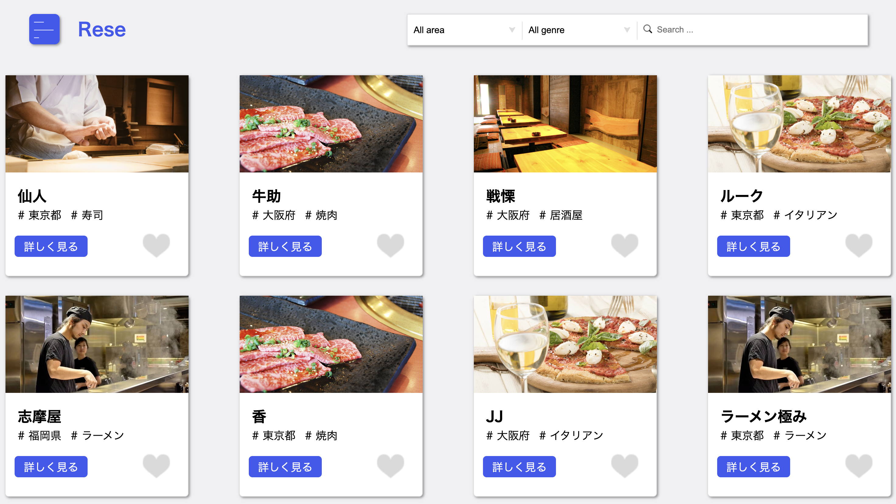

# 飲食店予約サービス
**概要**
飲食店の予約システムを作成しました。<br>
ログインユーザは登録されている飲食店に対して予約・レビュー投稿・お気に入り登録などが行えます。<br>
また、店舗代表者や管理者といった別途権限を用意し、機能要件を切り分けています。<br>



## 作成した目的
勉強のアウトプットとして作成しました。


## アプリケーションURL
- 一般ユーザログイン画面: http://localhost/login
- 店舗代表者ログイン画面: http://localhost/owner/login
- 管理者ログイン画面: http://localhost/admin/login
- phpMyAdmin: http://localhost:8080/

> ※ 開発環境によっては 以下のURLを使用してください。
- 一般ユーザログイン画面: http://127.0.0.1/login
- 店舗代表者ログイン画面: http://127.0.0.1/owner/login
- 管理者ログイン画面: http://127.0.0.1/admin/login
- phpMyAdmin: http://127.0.0.1:8080/


##　　機能一覧
**一般ユーザ権限**
ログイン機能、メール認証機能、予約追加/変更/削除、お気に入り追加/削除、検索、並び変え、<br>
レビュー投稿/変更/削除、リマインドメール受信、決済機能<br>

**店舗代表者権限**
ログイン機能、メール認証機能、自身が所有する店舗一覧表示、店舗一覧CSV出力、予約一覧表示、予約一覧CSV出力<br>
検索、並び変え、店舗情報登録/更新、予約内容変更/削除、予約受付設定変更、メール配信、QRコードで予約確認

**管理者権限**
ログイン機能、メール認証機能、店舗代表者情報一覧表示/変更/削除、店舗代表者一覧CSV出力、店舗代表者登録、<br>
登録店舗情報一覧表示/変更/削除、登録店舗一覧CSV出力、検索、並び変え、メール配信<br>


## 使用技術
- PHP(8.1.3)
- Laravel(8.83.29)
- MySQL(8.0.26)
- Fortify(1.19.1)
- stripe(17.5.0)
- JavaScript


## テーブル設計およびER図


## 環境構築
**Dockerビルド**
1. リポジトリをクローン
``` bash
git clone git@github.com:shiba013/reservation-service.git
```
2. ディレクトリに移動
``` bash
cd reservation-service
```
3. DockerDesktopアプリを立ち上げる
4. Dockerイメージのビルドとコンテナ起動
``` bash
docker-compose up -d --build
```

> *MacPCの場合、`no matching manifest for linux/arm64/v8 in the manifest list entries`のメッセージが表示されビルドができないことがあります。
エラーが発生する場合は、docker-compose.ymlファイルの「mysql」内に「platform」の項目を追加で記載してください*
``` bash
mysql:
    platform: linux/x86_64(この文追加)
    image: mysql:8.0.26
    environment:
```

**Laravel環境構築**
1. PHPコンテナに入る
``` bash
docker-compose exec php bash
```
2. Composerをインストールする
``` bash
composer install
```
3. 「.env.example」ファイルを 「.env」ファイルに命名を変更。または、新しく.envファイルを作成
``` bash
cp .env.example .env
```
4. .envに以下の環境変数を追加
``` text
DB_CONNECTION=mysql
DB_HOST=mysql
DB_PORT=3306
DB_DATABASE=laravel_db
DB_USERNAME=laravel_user
DB_PASSWORD=laravel_pass
```
5. アプリケーションキーの作成
``` bash
php artisan key:generate
```
6. マイグレーションの実行
``` bash
php artisan migrate
```
7. シーディングの実行
``` bash
php artisan db:seed
```

**認証メールアドレスの設定** <br>
mailtrapというツールを使用しています。<br>
以下のリンクから会員登録をしてください。<br>
https://mailtrap.io/

メールボックスのIntegrationsから 「laravel 7.x and 8.x」を選択し、<br>
.envファイルのMAIL_MAILERからMAIL_ENCRYPTIONまでの項目をコピー＆ペーストしてください。<br>
MAIL_FROM_ADDRESSは任意のメールアドレスを入力してください。<br>
MAIL_FROM_NAMEは任意の送信者の名前（メールの送信者に表示される名前）を入力してください。<br>
設定完了後、キャッシュクリアを実行してください。<br>
``` bash
php artisan config:clear
```

**stripe環境構築**
1. Stripeのアカウント作成
> 公式サイトを参照してStripeのアカウント作成を作成してください。<br>
> 公式サイト：https://dashboard.stripe.com/
2. stripe向けのパッケージのインストール
``` bash
docker-compose exec php bash
composer require stripe/stripe-php
```
3. 環境変数の設定
> .env ファイルに以下の設定を追加してください。必要な情報はStripeダッシュボードから取得できます。
``` text
STRIPE_SECRET_KEY=your_stripe_secret_key
STRIPE_PUBLIC_KEY=your_stripe_public_key
```

## 単体テスト
**単体テスト環境構築**
1. MYSQLコンテナに入る
``` bash
docker-compose exec mysql bash
```
2. MySQLにrootユーザーでログイン（パスワードはrootと入力）
``` bash
mysql -u root -p
```
3. テスト用データベースの存在を確認（データベース名: demo_test）
``` bash
show databases;
```
> 「demo_test」という名前のデータベースが存在する場合は、PHPコンテナへ移動してください。<br>
> 存在しない場合は、以下のコマンドを実行してテスト用データベースを作成してください。<br>
``` bash
create database demo_test;
```
4. 「.env」ファイルを 「.env.testing」ファイルに命名を変更。または、新しく.envファイルを作成
``` bash
cp .env .env.testing
```
5. .env.testingの以下の環境変数を変更
``` text
APP_ENV=test
DB_DATABASE=demo_test
DB_USERNAME=root
DB_PASSWORD=root
```
6. PHPコンテナに入る
``` bash
docker-compose exec php bash
```
7. テスト環境用のアプリケーションキーを生成
``` bash
php artisan key:generate --env=testing
```
8. 設定キャッシュをクリア
``` bash
php artisan config:clear
```
9. テスト環境用のテーブルを作成
``` bash
php artisan migrate --env=testing
```
10. テストの実行
``` bash
./vendor/bin/phpunit
```

## アカウントの種類
``` text
-------------------------
name: 一般ユーザ
email: user@example.com
password: user1234
権限: 一般ユーザ
-------------------------
name: 一般ユーザ1
email: user1@example.com
password: user0987
権限: 一般ユーザ
-------------------------
name: お店のオーナー
email: owner@example.com
password: owner1234
権限: 店舗代表者
-------------------------
name: お店のオーナー1
email: owner1@example.com
password: owner0987
権限: 店舗代表者
-------------------------
name: admin
email: admin@example.com
password: admin1234
権限: 管理者
-------------------------
```


## 動作確認時の注意事項
> 決済処理を行う際、以下設定を参照して行うようにしてください。
- カード決済方法
``` text
メールアドレス：任意のメールアドレス
カード番号：4242 4242 4242 4242
カード有効期限：未来の年月
セキュリティコード：任意の3桁の数字
カード保有者の名前：任意の名前
国または地域：任意の国名を選択
```